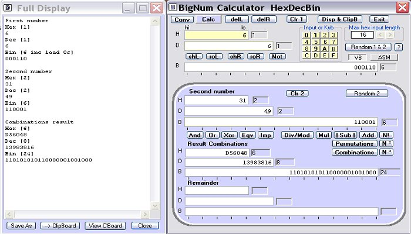



## BigNum Calculator\(Correction 1 Jul 2007\)\)

### Description

BigNum Calculator by Robert Rayment. Does calculations on, up to, 1024 bit numbers (~310 dec &amp; 256 hex digits). Operations on single numbers include shift left/right, roll left/right, Not, Factorial, Squared &amp; Cubed. On two numbers - And, Or, Xor, Eqv, Imp, Div/Mod, Mul, Sub &amp; Add. The full results can be displayed and saved to the clipboard or a file. All calculations are for positive integers only. Make sure to compile the program, particularly for large numbers. Machine code is used for some conversions to speed things up by a few seconds since they take much longer than calculations, principally for 4 digit factorials. For small numbers this has some educational value but very large numbers are just a curiosity, though apparently there is some use in encryption. Zip 27 KB.

----

Update: Added view clipboard.

----

Update2: Added permutations &amp; combination. Div correction.

----

Update3: Minor re-arrangements.

----

Update 1st July 2007: Correct FullIntDivision routine.
 
### More Info
 
Numbers

Just run

Calcs

             |
---                |---
**Submitted On**   |2006-04-06 11:23:04
**By**             |[Robert Rayment](https://github.com/Planet-Source-Code/PSCIndex/blob/master/ByAuthor/robert-rayment.md)
**Level**          |Intermediate
**User Rating**    |5.0 (80 globes from 16 users)
**Compatibility**  |VB 6\.0
**Category**       |[Math/ Dates](https://github.com/Planet-Source-Code/PSCIndex/blob/master/ByCategory/math-dates__1-37.md)
**World**          |[Visual Basic](https://github.com/Planet-Source-Code/PSCIndex/blob/master/ByWorld/visual-basic.md)
**Archive File**   |[BigNum\_Cal207347712007\.zip](https://github.com/Planet-Source-Code/robert-rayment-bignum-calculator-correction-1-jul-2007__1-64895/archive/master.zip)

### API Declarations

Memory, On top &amp; ASM APIs

